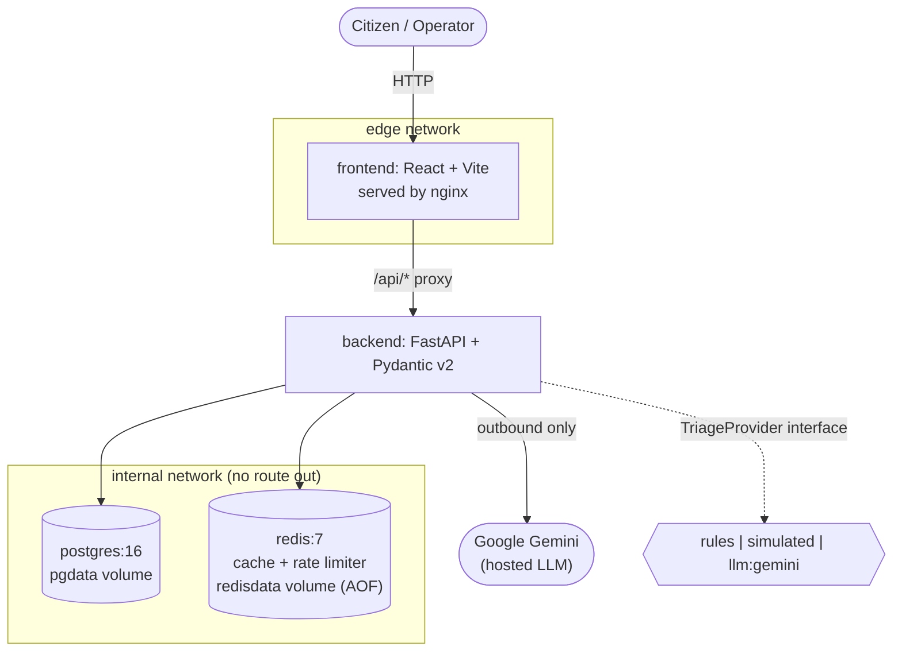

# CivicPulse

**A municipal complaint intake, triage and operations platform.** A citizen submits a
free-text complaint; the system validates it, triages it with an LLM into a category,
priority and one-line summary, persists it durably, and surfaces it on a live operations
dashboard.


CS4032 Software Construction and Design, Assignment 1.

## The problem

A citizen reporting a burst water main and a citizen reporting a broken streetlight both land
in the same undifferentiated queue. Nothing sorts them, so a human has to read every complaint
before anything urgent gets attention. A dropdown category picker does not fix this: citizens
pick "Other" to get through the form, or pick wrong. The information is in the free text, and
the reading has to be automated - but the reader (today a keyword rule, tomorrow an LLM) has
to be replaceable, and the system around it must not fall over when the clever one is
rate-limited, slow, or wrong. See `docs/adr/0001-provider-interface.md` for how that is solved.

## Architecture



Backend is the only service that bridges both networks: `internal: true` blocks the database
and cache from ever being reachable by the frontend, or from the internet at all. See
`docs/ENGINEERING-NOTES.md` question 7 for why the backend still needs a route out to call a
hosted LLM despite that.

## Quickstart

One command, from a clean clone:

```
cp .env.example .env
# edit .env: set a real GEMINI_API_KEY if you want TRIAGE_PROVIDER=llm; the default,
# TRIAGE_PROVIDER=simulated, needs no key at all and is what the command below uses.
docker compose up -d --build
```

That builds both images, brings up PostgreSQL and Redis, runs the database migrations and the
idempotent seed (32 realistic complaints) automatically, then starts the backend and frontend.
Verified end to end, including a full teardown/restart preserving all data:

```
curl http://localhost:3000/api/stats   # through the frontend's nginx proxy
curl http://localhost:8000/health      # backend directly
```

`docker compose exec frontend ping postgres` is expected to fail - that failure is the proof
that the frontend has no route to the database (see the architecture diagram above).

For a production-style run (pinned image tags, no source bind-mount, no published
database/cache ports): `docker compose -f compose.prod.yaml up -d`, with `IMAGE_TAG` set to a
real tag once images are published (see `docs/adr/0003-deploy-by-sha.md`).

## API contract

| Method | Path | Behaviour |
|---|---|---|
| POST | `/api/complaints` | Validate, redact, triage, persist. 201, or 400 with field-level errors, or 429 if rate-limited. |
| GET | `/api/complaints/{id}` | 200, or 404. |
| GET | `/api/complaints` | Filter by category/priority/status; paginated (`page`, `page_size` ≤ 100); returns `total`. |
| PATCH | `/api/complaints/{id}/status` | Enforces the state machine; 409 naming the attempted transition if invalid. |
| GET | `/api/stats` | Aggregate counts. Redis-cached, 30 s TTL, `X-Cache: HIT\|MISS`. |
| GET | `/api/meta/providers` | Active triage provider, last 20 outcomes, measured cache hit rate. |
| GET | `/health` | Liveness. Never touches the database. |
| GET | `/ready` | Readiness. 503 naming the failed dependency if Postgres or Redis is unreachable. |
| GET | `/metrics` | Prometheus text format: request/latency/triage metrics. |

Full interactive schema at `/docs` (Swagger UI) or `/openapi.json` once the backend is running.

## Screenshots

The Submit, Dashboard, and Stats views are built (`frontend/src/pages/`) - actual screenshots
still need capturing against a running instance and are tracked as a follow-up rather than
guessed at here.

## Repository layout

```
backend/    FastAPI app: routes/services/repositories/providers, Alembic migrations, tests
frontend/   React + Vite + TypeScript, served by nginx
k8s/        Kubernetes manifests: base + dev/prod overlays, HPA/VPA, load-test evidence
docs/       ADRs, engineering notes, AI usage disclosure, runbook, evidence screenshots
scripts/    check_submission.py, the pre-submission lint
```

## Status

Backend, AI layer, data layer, cache layer, and the dev/prod Compose stacks are complete and
tested (backend: 655 tests against real PostgreSQL and Redis, 99%+ coverage). Kubernetes is
complete and verified against a real cluster: namespace, StatefulSet+PVC for Postgres,
Deployment+PVC for Redis, backend/frontend Deployments with all three probes correct, Ingress,
PodDisruptionBudget, HPA and VPA (both proven with real load tests, not just applied - see
`k8s/evidence/`), and dev/prod Kustomize overlays. CI/CD (`ci.yml`/`cd.yml`/`release.yml`) is
built and verified running for real on GitHub Actions. The frontend's real views
(Submit/Dashboard/Stats) are built and tested (29 component tests). See
`docs/ENGINEERING-NOTES.md` for the honest state of what's pending and why, and
`docs/AI-USAGE.md` for a specific account of how AI assistance was
used throughout.

## Documentation

- [`docs/ENGINEERING-NOTES.md`](docs/ENGINEERING-NOTES.md) - answers to the assignment's eight engineering questions
- [`docs/RUNBOOK.md`](docs/RUNBOOK.md) - how to deploy, roll back, read logs, and debug a failing triage provider
- [`docs/AI-USAGE.md`](docs/AI-USAGE.md) - honest, specific AI-usage disclosure
- [`docs/adr/`](docs/adr/) - architecture decision records
